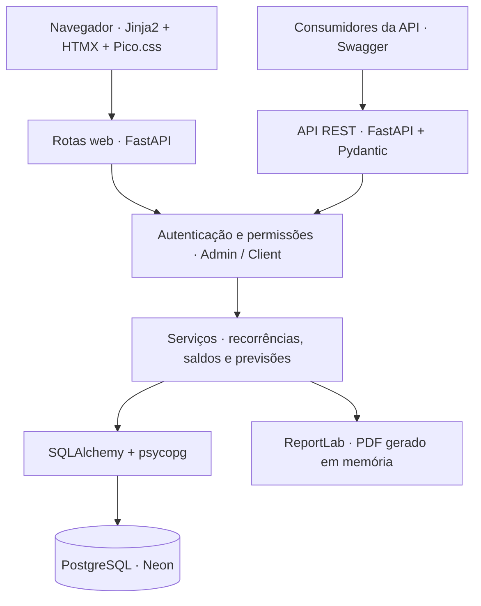

# Privio

**Clareza sobre o que pagar, o que já foi pago e o dinheiro disponível.**

O Privio é uma aplicação web para organizar compromissos financeiros, acompanhar
vencimentos e visualizar saldos e previsões. Ele conecta o trabalho de quem
administra as contas a uma visão simples para quem precisa acompanhar os pagamentos.

[Experimentar a demonstração](https://privio-demo.onrender.com/) ·
[Explorar a API](https://privio-demo.onrender.com/docs)

## Demonstração pública

Acesse **[privio-demo.onrender.com](https://privio-demo.onrender.com/)**.
Na tela de login, escolha **Admin** ou **Client** e digite a senha `test`.

| Perfil | Usuário da API | Senha | Acesso |
| --- | --- | --- | --- |
| **Admin** | `admin` | `test` | Gerenciar contas, receitas e pagamentos; consultar previsões e exportar relatórios. |
| **Client** | `client` | `test` | Consultar contas, saldos e previsões; exportar relatórios mensais. |

Os usuários da tabela também podem ser utilizados com autenticação Basic na API.
As credenciais são públicas e exclusivas desta demonstração.

> Os dados são fictícios e compartilhados entre visitantes. Não insira informações
> reais. Os exemplos são restaurados diariamente, por volta de **03:17 UTC**, e as
> alterações não são permanentes. O primeiro acesso após inatividade pode levar
> cerca de um minuto enquanto o serviço gratuito inicia.

## Funcionalidades

- **Visão mensal:** contas a pagar, pagamentos realizados, saldo disponível e
  valor que sobra ou falta para cobrir os compromissos.
- **Recorrências:** despesas únicas, semanais, mensais, semestrais e anuais, com
  ajustes para uma ocorrência ou para a série.
- **Pagamentos e receitas:** valores e datas efetivas, vínculo com contas
  financeiras e separação entre receitas previstas e recebidas.
- **Contas e reservas:** acompanhamento de saldos em diferentes contas e
  transferências internas.
- **Previsões:** fluxo de caixa de seis meses e agenda de compromissos de doze meses.
- **Relatório mensal em PDF:** contas, valores, vencimentos, totais pagos e
  pendentes, com data de exportação. Cada arquivo representa a situação daquele
  momento e é gerado sob demanda.
- **Dois perfis:** Admin para operação e Client para acompanhamento, com
  permissões verificadas no servidor.
- **Interface responsiva:** português, inglês e italiano; temas claro, escuro
  e automático nas páginas autenticadas.

## Telas do sistema

As imagens abaixo foram capturadas na demonstração, exclusivamente com dados fictícios.

### Login


### Visão Admin


### Visão Client


<details>
<summary>Exemplo de relatório mensal em PDF</summary>


</details>

## Arquitetura

O Privio utiliza uma aplicação FastAPI organizada em camadas. As rotas web
entregam páginas HTML renderizadas com Jinja2; o HTMX atualiza partes da interface
a partir das respostas do servidor. A API REST oferece acesso estruturado aos
compromissos, depósitos e consultas financeiras.



As regras financeiras ficam na camada de serviços, enquanto os modelos SQLAlchemy
representam compromissos, pagamentos, depósitos e contas. Os schemas Pydantic
validam as entradas e respostas da API. Valores monetários utilizam `Decimal`.

O login web usa cookies de sessão assinados; a API aceita autenticação Basic.
As configurações de cada ambiente são fornecidas por variáveis de ambiente.
A demonstração e o ambiente de uso real utilizam contas Render e Neon independentes,
com bancos e credenciais separados.

## Stack

| Camada | Tecnologias |
| --- | --- |
| Linguagem e servidor | Python 3.12, FastAPI, Uvicorn |
| Interface | Jinja2, HTMX, Pico.css, JavaScript |
| Persistência | PostgreSQL, SQLAlchemy 2, psycopg 3 |
| Validação e configuração | Pydantic, pydantic-settings |
| Relatórios | ReportLab |
| Dependências | uv e lockfile versionado |
| Qualidade | pytest, HTTPX, Ruff, ty, testes JavaScript com Node.js |
| Integração contínua | GitHub Actions, testes com PostgreSQL isolado |
| Hospedagem | Render para a aplicação, Neon para o banco |

## Estrutura do projeto

```text
app/
├── routers/       # Rotas web, API e exportação de relatórios
├── services/      # Regras financeiras, recorrências e PDFs
├── models/        # Modelos de persistência
├── schemas/       # Validação de entradas e respostas
├── templates/     # Páginas e componentes HTML
├── auth.py        # Autenticação e controle de acesso
├── config.py      # Configurações por ambiente
├── database.py    # Conexões e sessões de banco
├── i18n.py        # Traduções PT, EN e IT
└── main.py        # Aplicação FastAPI
scripts/           # Preparação do banco e manutenção da demo
tests/             # Testes automatizados
docs/              # Documentação técnica e imagens
.github/workflows/ # Integração contínua e restauração da demo
```

## Executar localmente

Pré-requisitos: Python 3.12, [uv](https://docs.astral.sh/uv/) e um banco PostgreSQL
exclusivo para desenvolvimento.

```bash
git clone https://github.com/medioalanum/privio_v1.git
cd privio_v1
cp .env.example .env
uv sync --frozen --all-groups
```

Configure no `.env` a conexão `DATABASE_URL`, os usuários e senhas de desenvolvimento
e uma `SESSION_SECRET` própria. Mantenha `DEMO_MODE=false` no desenvolvimento normal.

```bash
uv run python -m scripts.migrate
uv run uvicorn app.main:app --reload
```

A interface estará em `http://127.0.0.1:8000` e o Swagger em `/docs`.

## Testes e documentação

```bash
uv run ruff check .
uv run ruff format --check .
uv run ty check .
uv run pytest
node --test tests/browser/*.test.mjs
```

Os testes JavaScript requerem Node.js 22 ou superior. O GitHub Actions também
executa testes de integração com PostgreSQL em um banco isolado.

- [Configuração de hospedagem](DEPLOYMENT.md)
- [Operação e manutenção da demonstração](docs/DEMO_OPERATIONS.md)
- [Definições financeiras, backups e publicação de versões](docs/OPERATIONS.md)
